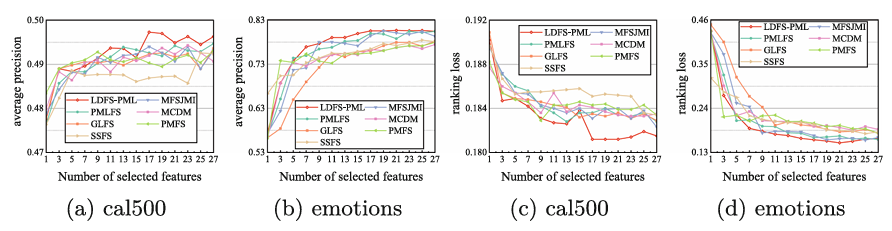
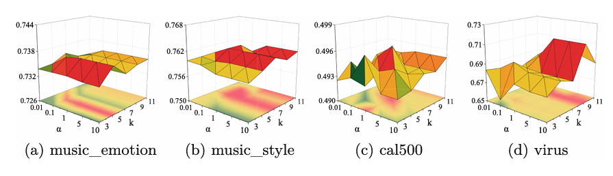

## Label Disambiguation-Based Feature Selection for Partial Multi-label Learning (ICPR, 2024, Oral)

## Introduction

This work proposes **LDFS-PML**, a novel two-stage framework that integrates label disambiguation and feature selection. It is the first attempt to leverage **granular ball computing** for multi-label disambiguation from a cognition computing perspective, making it robust to noisy supervision and suitable for high-dimensional data.

## Key Contributions

- **Granular Ball-Based Label Disambiguation**A specific granular ball (SGB) computing technique is developed to capture label-specific information embedded in data distributions. This allows reliable estimation of labeling confidence while filtering out false positives.
- **Filter-Based Feature Selection with Cognition Computing**A new filter method is designed that combines global similarity preservation with local consistency, inspired by cognition computing, to obtain a compact and discriminative feature subset for PML.
- **Two-Stage LDFS-PML Framework**The framework first performs label disambiguation to mitigate noise labels and then applies confidence-guided feature selection, ensuring both robustness and efficiency.





## Project Overview

This project implements Partial Multi-Label disambiguation using Granular Balls. For each label, the method constructs and splits/merges granular balls in the feature space to obtain high-purity regions and compute confidence scores for positive labels. The confidence matrix is then row-normalized to produce soft labels for downstream learning.

Main components:

- `GranularBall.py`: Defines the `GranularBall` and its list `GBList`, including initialization, 2-means split, merging, purity calculation, and covered data retrieval.
- `Disambiguate.py`: Performs per-label disambiguation, computes confidence for each sample-label pair, row-normalizes, and returns the confidence matrix with runtime.
- `main.py`: Batch runner with multiprocessing that processes specified datasets and noise settings and saves results.
- 

## Environment & Dependencies

- Python ≥ 3.8 (tested with 3.8–3.11)
- Key packages:
  - numpy
  - scipy
  - scikit-learn

Install dependencies (example):

```bash
pip install numpy scipy scikit-learn
```

## Data Format

Input is MATLAB `.mat` files with the following keys:

- `features`: float matrix of shape `(num_instances, num_features)`.
- `labels`: multi-label indicator matrix of shape `(num_instances, num_labels)`; entries typically in {0, 1}. If pseudo-positive labels exist, value 2 is internally treated as 1 for purity calculation.

The data path is specified by `dataset_file_url` in `main.py`. Example template:

```
..\..\PML datasets\{noise}\{dataset}.mat
```

Where `{noise}` can be `real` or a numeric ratio (e.g., `0.2`, `0.4`), and `{dataset}` is the dataset name.

Outputs are saved to:

```
disambiguation_result/noise_ratio_{noise}/{dataset}.mat
```

Each output `.mat` contains:

- `features`: the original feature matrix (copied from input).
- `labels`: the row-normalized label confidence matrix (disambiguation result).

## How to Run

### Option A: Batch run (recommended)

Edit the following items in `main.py` and run:

- `dataset_list`: list of dataset names to process.
- `dataset_file_url`: template to locate input `.mat` files.
- `processing_num`: number of parallel processes.
- `noise_ratio_list`: noise markers (e.g., `"real"` or multiple ratios).

Command:

```bash
python main.py
```

Results will be placed under `disambiguation_result/noise_ratio_{noise}/`.

### Important settings in main.py

- `dataset_list`: datasets to process.
- `dataset_file_url`: template path containing `{noise}` and `{dataset}` placeholders.
- `processing_num`: number of processes.
- `noise_ratio_list`: list of noise settings (e.g., `['real']` or `[0.2, 0.4, 0.6]`).

## Repository Structure

├─ GranularBall.py      # Granular ball and GB list implementation

├─ Disambiguate.py      # Label disambiguation based on granular balls

├─ main.py              # Batch entry point with multiprocessing

└─ disambiguation_result/  # Output directory created after running

## FAQ

- Path or loading errors: verify `dataset_file_url` matches your local data layout (watch for Windows backslash escaping and relative roots).
- Performance tips:
  - Reduce the size of `dataset_list` or the combinations in `noise_ratio_list`.
  - Tune `processing_num` to match available CPU cores.
  - If needed, reduce similarity computations by adjusting thresholds in `Disambiguate.py`.
- Interpreting results: `labels` in outputs are row-normalized confidences suitable as soft labels for multi-label learning.

## Citation

If you use this code, please cite our work.

BibTeX template:

```bibtex
@InProceedings{10.1007/978-3-031-78183-4_17,
author="Xu, Fankang
and Qian, Wenbin
and Cai, Xingxing
and Shu, Wenhao
and Huang, Jintao
and Cheung, Yiu-Ming
and Ding, Weiping",
title="Label Disambiguation-Based Feature Selection for Partial Multi-label Learning",
booktitle="Pattern Recognition",
year="2025",
pages="265--279",
}


```
